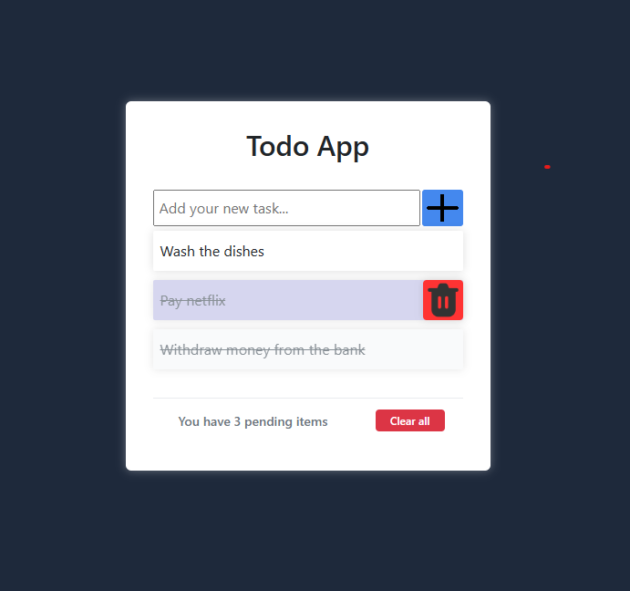

# 📝 Todo App - Task Manager Frontend

A modern, responsive Todo application built with React, TypeScript, and Vite. This application provides a clean and intuitive interface for managing tasks with real-time updates and smooth animations.

## 📸 Screenshots

### Home Page


*Clean and modern interface with task management capabilities*

## 🚀 Features

### Core Functionality
- ✅ **Add Tasks** - Create new tasks with a simple input field
- ✅ **Delete Tasks** - Remove individual tasks with confirmation modal
- ✅ **Toggle Completion** - Mark tasks as complete/incomplete by clicking
- ✅ **Delete All** - Clear all tasks with confirmation
- ✅ **Real-time Updates** - Immediate UI updates with server synchronization

### User Experience
- 🎨 **Modern UI** - Clean, minimalist design with smooth animations
- 📱 **Responsive Design** - Works perfectly on desktop and mobile devices
- ⚡ **Fast Performance** - Built with Vite for lightning-fast development
- 🎯 **Intuitive Interactions** - Hover effects and visual feedback
- 🔄 **Smooth Animations** - Modal fade-ins and button transitions

### Technical Features
- 🔒 **Type Safety** - Full TypeScript implementation
- 🎭 **Component Architecture** - Modular, reusable components
- 🌐 **API Integration** - RESTful API communication with Spring Boot backend
- 🛡️ **Error Handling** - Comprehensive error management and user feedback
- 📊 **State Management** - Efficient React state management

## 🏗️ Architecture

### Project Structure
```
task-manager-frontend/
├── src/
│   ├── components/
│   │   ├── Card/
│   │   │   ├── Card.tsx          # Individual task component
│   │   │   └── Card.css          # Task styling with hover effects
│   │   └── ConfirmModal/
│   │       ├── Modal.tsx         # Reusable confirmation modal
│   │       └── Modal.css         # Modal styling with animations
│   ├── pages/
│   │   └── Home/
│   │       ├── Home.tsx          # Main application component
│   │       └── Home.css          # Main page styling
│   ├── App.tsx                   # Root component
│   └── main.tsx                  # Application entry point
├── public/
│   └── images/                   # Static assets (add.png, trash.png)
├── package.json                  # Dependencies and scripts
├── vite.config.ts               # Vite configuration with proxy
└── README.md                    # This file
```

## 🔧 API Integration

### Endpoints
```javascript
// Task Management
GET    /api/get-tasks          # Fetch all tasks
POST   /api/add-task           # Create new task
PUT    /api/complete-task/{id} # Update task completion
DELETE /api/delete-task/{id}   # Delete individual task
POST   /api/delete-all         # Delete all tasks
```

### Data Structure
```typescript
interface Task {
  id: number;
  description: string;
  isComplete: boolean;
}
```

## 🚀 Getting Started

### Prerequisites
- **Node.js** (v16 or higher)
- **npm** or **yarn**
- **Spring Boot Backend** running on port 8085

### Installation

1. **Clone the repository**
   ```bash
   git clone <repository-url>
   cd task-manager-frontend
   ```

2. **Install dependencies**
   ```bash
   npm install
   ```

3. **Start the development server**
   ```bash
   npm run dev
   ```

4. **Open your browser**
   Navigate to `http://localhost:5173`

### Development Commands
```bash
npm run dev          # Start development server
npm run build        # Build for production
npm run preview      # Preview production build
npm run lint         # Run ESLint
```

## 🎯 Key Features Implementation

### Task Management
- **Add Tasks**: Real-time input validation and immediate UI updates
- **Delete Tasks**: Confirmation modal with smooth animations
- **Toggle Completion**: Visual feedback with strikethrough and color changes
- **Bulk Operations**: Delete all tasks with confirmation

### User Interface
- **Responsive Design**: Flexbox-based layout that adapts to screen size
- **Hover Effects**: Interactive buttons with smooth transitions
- **Modal System**: Centered modals with backdrop and animations
- **Loading States**: Visual feedback during API operations

## 📈 Future Enhancements

### Planned Features
- 🔐 **User Authentication** - Login/logout functionality
- 📱 **PWA Support** - Progressive Web App capabilities
- 🎨 **Theme System** - Dark/light mode toggle
- 📊 **Task Categories** - Organize tasks by categories
- ⏰ **Due Dates** - Task deadline management
- **Edit Description** - Edit selected description

## 🤝 Contributing


## 📄 License

This project is licensed under the MIT License - see the LICENSE file for details.

